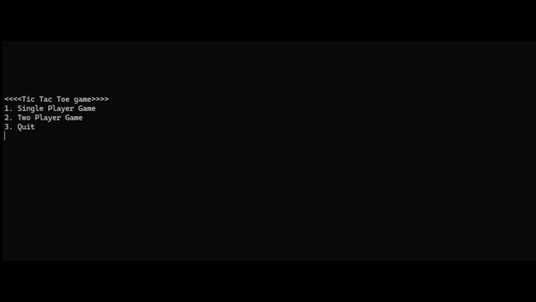

# Tic Tac Toe Game

## Overview
Welcome to my Tic Tac Toe game! This is a classic game developed using Java that offers single player and two player modes. Enjoy challenging your friends or playing against an intelligent bot!

## Features
### Single-player mode

Single-player mode allows you to play against a smart bot that will try to win while stopping you from winning! You can choose to start first by being Player 1, or let the computer start first by being Player 2.

### Two-player mode

Two-player mode allow 2 users to play against each other. You can choose to start as Player 1 or Player 2.

